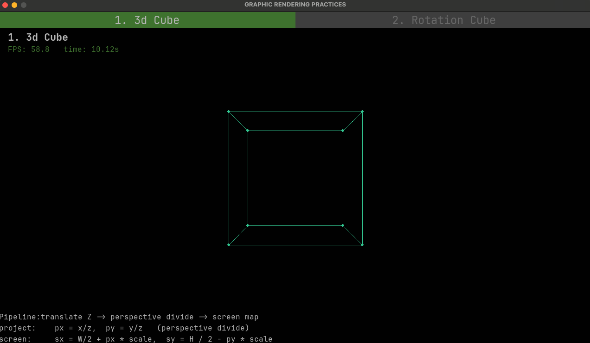
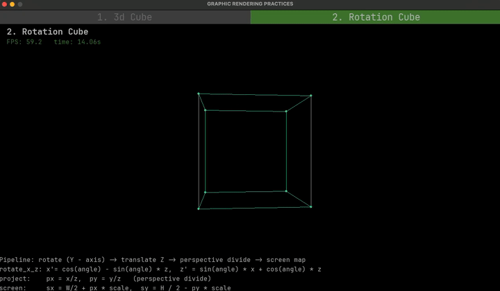

# graphic-practice
- [One Formula That Demystifies 3D Graphics](https://www.youtube.com/watch?v=qjWkNZ0SXfo): Provides a straightforward simulation of a rendering engine and elucidates the fundamental formula for transforming a point from 3D space into 2D screen coordinates.
- [python data structures](https://www.geeksforgeeks.org/python/python-data-structures/): Provides information regarding the usage and memory layout of data types in Python.

# Demo

|   [`demo/simple_cube.py`](demo/simple_cube.py) |    [`demo/rotation_cube.py`](demo/rotation_cube.py) |
| -------------- | --------------- |
|   [`demo/simple_cube.py`](demo/simple_cube.py) |    [`demo/rotation_cube.py`](demo/rotation_cube.py) |

