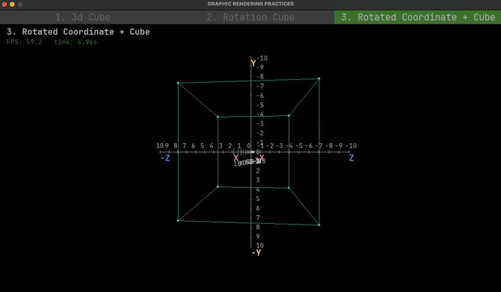

# graphic-practice

[](https://discord.gg/a2qzfrFzWT)


## Overview
This project is dedicated to exploring and testing mathematical formulas and theories as part of my ongoing study of computer graphics principles.

## Setup
### MacOS
```bash
brew install uv # install tool chain
uv sync # install dependencies
uv run main.py # launch app
```
### Window
TODO: implement docs for this

### Linux
TODO: implement docs for this


## Preface
While I do not possess profound expertise in Python, I selected it as a learning tool because of its capacity for rapid idea implementation and its comprehensive library ecosystem, which offers readily available solutions for nearly every requirement.

Consequently, the code quality within this project may not reflect professional standards.

To actualize my conceptual designs, I opted to utilize the `pygame` library. I commissioned Claude to generate these two files to facilitate my understanding of `pygame` library usage:

**Prompt Input:** 
```txt
Override `main.py`. Develop an example program to showcase all Pygame features. It's important to note that this Python project serves as a platform for learning graphic rendering. Therefore, please list the essential features relevant to my learning objectives.
```
- [`pygame_features.py`](pygame_features.py)
- [`pygame_features_main.py`](pygame_features_main.py)

If you, like me, are not yet fully familiar with how to use `Python` and `pygame`, you should review these two files to gain a clear understanding of their usage.

To run `pygame` feature previews, use the following command:

```bash
uv run pygame_features_main.py
```

## Demo
TODO: Provide comprehensive documentation for each demo.

| <br> [`demo/simple_cube.py`](demo/simple_cube.py) |  <br> [`demo/rotation_cube.py`](demo/rotation_cube.py) |
| -------------- | --------------- |
| <br> [`demo/rotated_coordinate_cube.py`](demo/rotated_coordinate_cube.py) |  <br> [`demo/rotation_cube.py`](demo/rotation_cube.py) |

## Checklist
- [x] Fundamentals of 2D to 3D Conversion
- [ ] Draw an oriented triangle in 3D space

## References
- [x] [python data structures](https://www.geeksforgeeks.org/python/python-data-structures/): Provides information regarding the usage and memory layout of data types in Python.
- [x] [One Formula That Demystifies 3D Graphics](https://www.youtube.com/watch?v=qjWkNZ0SXfo): Provides a straightforward simulation of a rendering engine and elucidates the fundamental formula for transforming a point from 3D space into 2D screen coordinates.
- [ ] [points-vectors-and-normals](https://www.scratchapixel.com/lessons/mathematics-physics-for-computer-graphics/geometry/points-vectors-and-normals.html)
- [ ] [spherical-coordinates-and-trigonometric-functions](https://www.scratchapixel.com/lessons/mathematics-physics-for-computer-graphics/geometry/spherical-coordinates-and-trigonometric-functions.html)


